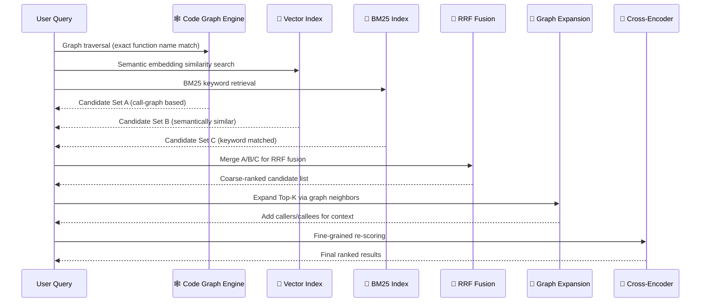
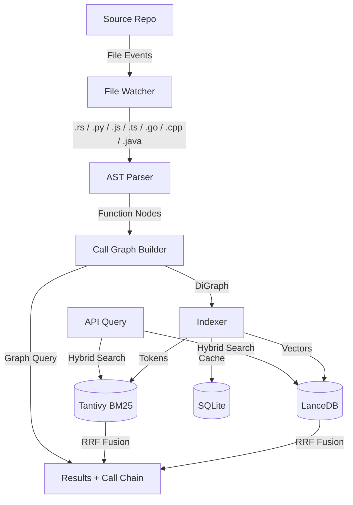

<p align="center">
  
</p>

<h1 align="center">CodeActor Codebase</h1>

<p align="center">
  <b>A Dual-Engine Code Intelligence & Retrieval System</b> <br>
  🕸️ Call Graph Engine · 🌌 Semantic Vector Index · 🔍 Hybrid Search · ⚡ Real-time · 🌐 10+ API
</p>

<p align="center">
  
  
  
  
  
</p>

---

## 🔥 Overview

**CodeActor Codebase** is a high-performance code intelligence and retrieval system built with **Rust**. Think of it as a **CT scan for your codebase** — it doesn't just parse your source code; it builds a complete **function call graph** AND a **semantic vector index**, then fuses them together through a sophisticated hybrid retrieval pipeline.

> 🎯 **Core Value**: Transform your chaotic codebase into a navigable, searchable, and machine-understandable knowledge graph.

```bash
# Start the code analysis service with one command
cargo run -- server --repo-path /path/to/your/repo

# Search code with natural language
curl -X POST http://localhost:12800/semantic_search \
  -H "Content-Type: application/json" \
  -d '{"text": "handle HTTP request and return JSON response"}'
```

---

## ✨ Highlights

### 🧠 Dual-Engine Indexing Architecture

We understand your codebase from **two complementary dimensions** — structural graphs and semantic vectors:

| Engine | Tech Stack | Core Capabilities |
|:---|:---|:---|
| 🕸️ **Code Graph Engine** | `PetCodeGraph` (petgraph call graph) | Precise call paths · Cycle detection · Topological sort · SCC analysis |
| 🌌 **Semantic Index Engine** | `LanceDB` vector embeddings + `Tantivy` BM25 full-text | Natural language search · Fuzzy matching · Code meaning understanding |

> **Why two engines?** The graph engine can tell you which functions `main` calls, but can't understand what "handle user login" means. The semantic engine understands intent, but doesn't know call chain context. **Together, they provide better recall and more accurate ranking.**

### 🔄 Hybrid Retrieval Pipeline

A single query triggers a complete pipeline: **multi-path recall → RRF fusion → graph expansion → fine-grained re-ranking**.

1. **Parallel Multi-Path Recall** — Graph traversal + vector semantic search + BM25 keyword matching
2. **RRF Fusion** — `Reciprocal Rank Fusion` fairly merges heterogeneous scores, no manual weight tuning needed
3. **Graph Expansion** — Leverages call relationships to expand Top-K results with their callers/callees, providing full context
4. **Cross-Encoder Re-ranking** — Full-interaction scoring for each (query, code) pair, maximizing ranking precision

### ⚡ Industrial-Grade Engineering

| Feature | Implementation |
|:---|:---|
| 🔄 **Incremental Builds** | MD5 hash skips unchanged files — large repos update in seconds |
| 👀 **Live File Watch** | `notify`-based 20s debounced auto re-indexing on save |
| 🧠 **Multi-Layer Cache** | SQLite embedding cache keyed by `md5(model+code)` — reduces API costs by 90%+ |
| 🌐 **Ready-to-Use API** | 10+ REST endpoints · ECharts interactive visualization · Repo panorama analysis |
| 🗣️ **7 Languages** | Rust · Python · JavaScript · TypeScript · Go · C/C++ · Java |

---

## 🔍 Intelligent Retrieval Pipeline

Here's what happens behind the scenes when you search for `"handle HTTP request and return JSON"`:



**Design Philosophy:**

| Stage | Principle | Why It Matters |
|:---|:---|:---|
| **Multi-Path Recall** | Recall-first | Cast a wide net — graph, vector, and keywords together ensure nothing is missed |
| **RRF Fusion** | Fair blending | No single recall path is favored; avoids score normalization bias |
| **Graph Expansion** | Context enrichment | Results carry their call chain context — no more isolated code snippets |
| **Re-ranking** | Precision filtering | Cross-Encoder full-interaction comparison maximizes final ranking accuracy |

> 💡 No manual configuration needed — the pipeline runs automatically. All parameters are tunable for advanced use cases.

---

## 🚀 Quick Start

### Prerequisites

- Rust 1.70+
- (Optional) Embedding API Token — required for semantic search (e.g., [SiliconFlow](https://siliconflow.cn))

### Build

```bash
git clone <your-repo-url>
cd codeactor-agent/codebase
cargo build --release
```

### Start the Server

```bash
# Bind to a repository
cargo run -- server --repo-path /path/to/your/repo

# Custom address and port
cargo run -- server --repo-path /path/to/your/repo --address 0.0.0.0:12800

# Choose storage mode (json / binary / both)
cargo run -- server --repo-path /path/to/your/repo --storage-mode binary
```

On startup, the service automatically performs: **Graph Building → Vector Indexing → File Watching**, then binds the HTTP port.

---

## 🏗️ System Architecture



### Architecture Layers

| Layer | Module | Responsibility |
|:---|:---|:---|
| 🚪 Entry | `main.rs` | CLI arg parsing (`clap`), dispatch to server/vectorize |
| ⚙️ Config | `config.rs` | Load config from `~/.codeactor/config/config.toml` |
| 🌐 HTTP | `http/` | Axum routes, request handling, response models, ECharts templates |
| 📦 State | `storage/` | `StorageManager` — central hub for graph, persistence, watchers, tasks |
| 🧠 Services | `services/` | High-level analysis: CodeAnalyzer, EmbeddingService, HybridSearch |
| 📐 Core | `codegraph/` | AST parsing + graph data structures + multi-language Tree-sitter parsers |
| 🖥️ CLI | `cli/` | CLI args, offline analysis, vectorization |

---

## 📡 API Reference

### Endpoints

| Method | Path | Description |
|:---|:---|:---|
| `GET` | `/health` | Health check |
| `GET` | `/status` | Repo status (functions, files, indexing state) |
| `POST` | `/query_call_graph` | Query function call graph (recursive expansion) |
| `POST` | `/query_code_snippet` | Extract code snippet with line numbers |
| `POST` | `/query_code_skeleton` | Batch-extract file skeletons (function/class signatures) |
| `POST` | `/query_hierarchical_graph` | Hierarchical call tree (root function + depth) |
| `POST` | `/investigate_repo` | **Panoramic analysis**: Top 15 core functions + file tree + skeletons |
| `POST` | `/semantic_search` | **Semantic search**: natural language code search |
| `POST` | `/query_indexing_status` | Query embedding index status |
| `GET` | `/draw_call_graph` | ECharts interactive call graph visualization |

> All responses follow a unified format: `{ "success": true, "data": { ... } }`

### Usage Examples

**🔍 Semantic Search** — Find code with natural language

```bash
curl -X POST http://localhost:12800/semantic_search \
  -H "Content-Type: application/json" \
  -d '{"text": "handle HTTP request and return JSON response", "limit": 10}'
```

**🕸️ Call Graph Query** — Explore function relationships

```bash
curl -X POST http://localhost:12800/query_call_graph \
  -H "Content-Type: application/json" \
  -d '{"filepath": "src/main.rs", "function_name": "main", "max_depth": 3}'
```

**📊 Repository Panorama** — One-click global view

```bash
curl -X POST http://localhost:12800/investigate_repo \
  -H "Content-Type: application/json" \
  -d '{}'
```

**📂 Hierarchical Call Tree** — Expand from root function

```bash
curl -X POST http://localhost:12800/query_hierarchical_graph \
  -H "Content-Type: application/json" \
  -d '{"root_function": "main", "max_depth": 3, "include_file_info": true}'
```

### Visualization

Open `http://localhost:12800/` or `http://localhost:12800/draw_call_graph?filepath=src/main.rs&function_name=main&max_depth=3` in your browser to explore the interactive ECharts call graph.

---

## ⚙️ Configuration

Configuration file at `~/.codeactor/config/config.toml`:

```toml
[http]
server_port = 12800

[codebase]
enable_embedding = true
embedding_db_uri = "data/lancedb"
graph_db_uri = ".codegraph_db"

[codebase.embedding]
model = "Qwen/Qwen3-Embedding-4B"
api_token = "sk-..."
api_base_url = "https://api.siliconflow.cn/v1"
dimensions = 2560

[codebase.retrieval_pipeline]
enable_sparse = true              # Enable BM25 full-text search
sparse_search_limit_factor = 2    # Sparse search amplification factor
short_code_threshold = 30         # Short code penalty threshold (chars)
short_code_penalty = 0.5          # Short code penalty factor
enable_reranker = false           # Enable reranking
```

---

## 🧪 Development

```bash
# Run tests
cargo test

# Run all functional tests
bash tests/run_functional_tests.sh

# View test logs
cargo test -- --nocapture
```

---

## 🗂️ Project Structure

```
src/
├── main.rs              # CLI entry: server / vectorize subcommands
├── lib.rs               # Module exports
├── config.rs            # Config loader
├── cli/                 # CLI interface (args / runner / analyze / vectorize)
├── codegraph/           # ⭐ Code graph core
│   ├── types.rs         # PetCodeGraph · EntityGraph · FileIndex
│   ├── parser.rs        # CodeParser: AST parsing + incremental build
│   ├── graph.rs         # Flat CodeGraph (HashMap-based)
│   ├── chunker.rs       # Code chunking
│   └── treesitter/      # 7-language AST parsers
├── services/            # ⭐ High-level services
│   ├── analyzer.rs      # CodeAnalyzer: call chains · cycle detection · complexity
│   ├── embedding_service.rs    # LanceDB vector embedding + SQLite cache
│   ├── hybrid_search.rs       # Vector + BM25 + RRF hybrid search
│   ├── reranker_service.rs    # Cross-Encoder reranking
│   └── snippet_service.rs     # Code snippet extraction + cache
├── storage/             # Persistence + file watching
│   ├── mod.rs           # StorageManager: central state hub
│   ├── persistence.rs   # Graph JSON/Binary persistence
│   ├── petgraph_storage.rs    # Multi-format serialization
│   ├── incremental.rs   # MD5 incremental change detection
│   └── tantivy_index.rs       # BM25 full-text search index
└── http/                # HTTP service layer
    ├── server.rs        # CodeBaseServer: startup + routes
    ├── handlers/        # Request handlers (query / search / investigate / embed)
    └── models/          # Request/response data structures
```

---

## 💡 Design Philosophy

| Principle | Implementation |
|:---|:---|
| **One Process, One Repo** | Each process binds to a single repo. No API ambiguity. Multiple repos → multiple instances |
| **Incremental-First** | MD5 hash skips unchanged files. Position-based dedup. Large repos update in seconds |
| **Hybrid Retrieval** | Vector semantics + BM25 full-text + RRF fusion + optional reranking for maximum precision |
| **Graceful Degradation** | Sparse channel fails → fallback to vector-only. Reranker fails → fallback to RRF. Every path has a fallback |
| **Layered Caching** | SQLite embedding cache eliminates redundant API calls, reducing costs by 90%+ |
| **Type-Driven Design** | Rust's type system encodes design intent. `DiGraph` + bidirectional mapping ensure memory safety |

---

## 📋 Supported Languages

| Language | Functions | Structs/Classes | Function Calls |
|:---|:---:|:---:|:---:|
| Rust | ✅ | ✅ | ✅ |
| Python | ✅ | ✅ | ✅ |
| JavaScript | ✅ | ✅ | ✅ |
| TypeScript | ✅ | ✅ | ✅ |
| Go | ✅ | ✅ | ✅ |
| C/C++ | ✅ | ✅ | ✅ |
| Java | ✅ | ✅ | ✅ |

---

## 🤝 Contributing

Contributions are welcome! Whether it's submitting an issue, improving documentation, or opening a PR — we appreciate all forms of contribution.

1. Fork the repo
2. Create your feature branch (`git checkout -b feature/amazing-feature`)
3. Commit your changes (`git commit -m 'Add amazing feature'`)
4. Push to the branch (`git push origin feature/amazing-feature`)
5. Open a Pull Request

---

## 📄 License

**MIT** © CodeActor

Built with amazing open-source projects: Tree-sitter · Petgraph · LanceDB · Tantivy · Axum · Tokio · Clap

---

<p align="center">
  If you find this project useful, please ⭐️ Star it!<br>
  <sub>Built with ❤️ and Rust</sub>
</p>
