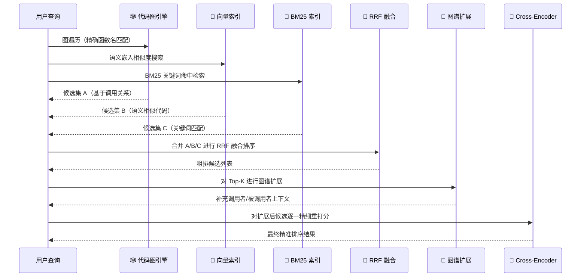
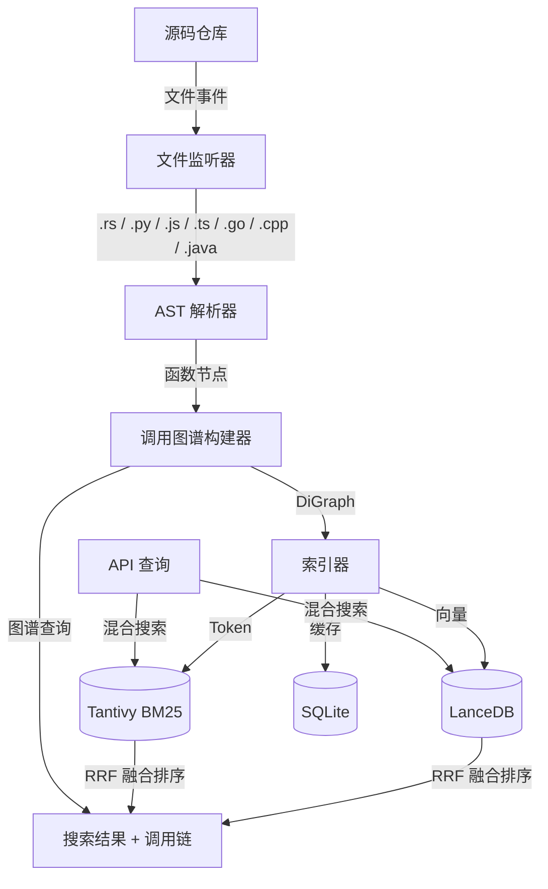

<p align="center">
  
</p>

<h1 align="center">CodeActor Codebase</h1>

<p align="center">
  <b>融合代码图与语义向量的双引擎代码智能检索系统</b> <br>
  🕸️ 函数调用图谱 · 🌌 向量语义索引 · 🔍 混合检索 · ⚡ 实时增量 · 🌐 10+ API
</p>

<p align="center">
  
  
  
  
  
</p>

---

## 🔥 项目简介

**CodeActor Codebase** 是一个用 **Rust** 构建的双引擎代码智能检索系统。它不仅像一张「代码的 CT 扫描图」——深入解析 AST 构建函数调用图谱，还同时为代码建立**语义向量索引**，让你可以用自然语言搜索代码，并通过**混合检索流水线**将图遍历、向量搜索、BM25 关键词匹配融合为精准结果。

> 🎯 **核心价值**：将混乱的代码仓库变为可导航、可搜索、可理解的知识图谱

```bash
# 一条命令启动代码分析服务
cargo run -- server --repo-path /path/to/your/repo

# 用自然语言搜索代码
curl -X POST http://localhost:12800/semantic_search \
  -H "Content-Type: application/json" \
  -d '{"text": "处理HTTP请求并返回JSON"}'
```

---

## ✨ 核心亮点

### 🧠 双引擎索引架构

我们同时从两个维度理解你的代码库——**结构化图谱**与**语义向量**，二者互补，缺一不可：

| 引擎 | 技术栈 | 核心能力 |
|:---|:---|:---|
| 🕸️ **代码图引擎** | `PetCodeGraph`（petgraph 函数调用有向图） | 精确调用路径 · 循环检测 · 拓扑排序 · SCC 分析 |
| 🌌 **语义索引引擎** | `LanceDB` 向量嵌入 + `Tantivy` BM25 全文检索 | 自然语言搜索 · 中英文模糊匹配 · 代码含义理解 |

> **为什么需要两个引擎？** 图引擎能回答 `main` 调用了哪些函数，但无法理解"处理用户登录"是什么含义；语义引擎能理解语义，但不知道调用链上下文。**双引擎互补，召回更全，排序更准。**

### 🔄 混合检索流水线

一次查询自动触发**多路召回 → 融合排序 → 图谱扩展 → 精细重排**的完整流水线：

1. **多路并行召回** — 图遍历候选 + 向量语义召回 + BM25 关键词命中
2. **RRF 融合排序** — `Reciprocal Rank Fusion` 公平融合异构分数，无需手动调权
3. **图谱扩展** — 利用调用关系扩散 Top-K 结果的调用者/被调用者，补全上下文
4. **Cross-Encoder 重排序** — 对每对 (查询, 代码) 全交互精细打分，最大化排序精度

### ⚡ 工程化加持

| 能力 | 实现 |
|:---|:---|
| 🔄 **增量构建** | MD5 哈希跳过未变更文件，大型仓库秒级增量更新 |
| 👀 **实时文件监听** | notify 20 秒防抖，保存即触发自动重索引 |
| 🧠 **多层缓存** | SQLite 嵌入缓存 `md5(model+code)`，API 调用成本降低 90%+ |
| 🌐 **即用 API** | 10+ REST 端点 · ECharts 交互式可视化 · 仓库全景分析 |
| 🗣️ **7 种语言** | Rust · Python · JavaScript · TypeScript · Go · C/C++ · Java |

---

## 🔍 智能检索引擎详解

一次代码搜索请求背后的完整旅程。假设你输入 `"handle HTTP request and return JSON"`：



**设计哲学：**

| 阶段 | 原则 | 为什么重要 |
|:---|:---|:---|
| **多路召回** | 召回优先 | 宁可多捞，不错过任何可能相关的代码。图、向量、关键词三路保障 |
| **RRF 融合** | 公平融合 | 不偏袒任何一路召回，避免分数归一化导致的尺度偏差 |
| **图谱扩展** | 上下文增强 | 让结果自带调用链上下文，避免返回孤立的代码片段 |
| **重排序** | 精细甄别 | Cross-Encoder 全交互比对，最大化最终排序的精准度 |

> 💡 你无需手动配置这些环节——系统自动执行整条流水线，所有参数均可按需调优。

---

## 🚀 快速开始

### 前置条件

- Rust 1.70+
- （可选）嵌入 API Token — 用于语义搜索（如 [SiliconFlow](https://siliconflow.cn)）

### 构建

```bash
git clone <your-repo-url>
cd codeactor-agent/codebase
cargo build --release
```

### 启动服务

```bash
# 绑定一个开源仓库（例如你的项目）
cargo run -- server --repo-path /path/to/your/repo

# 自定义地址端口
cargo run -- server --repo-path /path/to/your/repo --address 0.0.0.0:12800

# 选择存储模式（json / binary / both）
cargo run -- server --repo-path /path/to/your/repo --storage-mode binary
```

启动后，服务会自动完成：**图谱构建 → 向量索引 → 文件监听**，然后绑定 HTTP 端口。

---

## 🏗️ 系统架构



### 架构分层

| 层级 | 模块 | 职责 |
|:---|:---|:---|
| 🚪 入口 | `main.rs` | CLI 参数解析 (`clap`)，分发到 server/vectorize |
| ⚙️ 配置 | `config.rs` | 从 `~/.codeactor/config/config.toml` 加载配置 |
| 🌐 HTTP | `http/` | Axum 路由、请求处理、响应模型、ECharts 模板 |
| 📦 状态 | `storage/` | `StorageManager` 中心管理：图谱、持久化、监听、任务 |
| 🧠 服务 | `services/` | 高级分析：CodeAnalyzer、EmbeddingService、HybridSearch |
| 📐 核心 | `codegraph/` | AST 解析 + 图谱数据结构 + 多语言 Tree-sitter 解析器 |
| 🖥️ CLI | `cli/` | 命令行参数定义、离线分析/向量化 |

---

## 📡 API 参考

### 端点一览

| 方法 | 路径 | 说明 |
|:---|:---|:---|
| `GET` | `/health` | 健康检查 |
| `GET` | `/status` | 仓库状态（函数数、文件数、索引状态） |
| `POST` | `/query_call_graph` | 查询函数调用图谱（支持递归展开） |
| `POST` | `/query_code_snippet` | 提取函数代码片段（带行号上下文） |
| `POST` | `/query_code_skeleton` | 批量提取文件骨架（函数/类签名） |
| `POST` | `/query_hierarchical_graph` | 层级调用树（指定根函数和深度） |
| `POST` | `/investigate_repo` | **仓库全景分析**：Top15 核心函数 + 目录树 + 骨架 |
| `POST` | `/semantic_search` | **语义搜索**：用自然语言搜索代码 |
| `POST` | `/query_indexing_status` | 嵌入索引进度查询 |
| `GET` | `/draw_call_graph` | ECharts 交互式调用图谱可视化 |

> 所有响应统一格式：`{ "success": true, "data": { ... } }`

### 使用示例

**🔍 语义搜索** — 用自然语言找到匹配的代码

```bash
curl -X POST http://localhost:12800/semantic_search \
  -H "Content-Type: application/json" \
  -d '{"text": "handle HTTP request and return JSON response", "limit": 10}'
```

**🕸️ 调用图谱查询** — 探索函数调用关系

```bash
curl -X POST http://localhost:12800/query_call_graph \
  -H "Content-Type: application/json" \
  -d '{"filepath": "src/main.rs", "function_name": "main", "max_depth": 3}'
```

### 可视化

浏览器访问 `http://localhost:12800/` 或 `http://localhost:12800/draw_call_graph?filepath=src/main.rs&function_name=main&max_depth=3`，即可在交互式 ECharts 图谱中探索函数调用关系。

---

## ⚙️ 配置

配置文件位于 `~/.codeactor/config/config.toml`：

```toml
[http]
server_port = 12800

[codebase]
enable_embedding = true
embedding_db_uri = "data/lancedb"
graph_db_uri = ".codegraph_db"

[codebase.embedding]
model = "Qwen/Qwen3-Embedding-4B"
api_token = "sk-..."
api_base_url = "https://api.siliconflow.cn/v1"
dimensions = 2560

[codebase.retrieval_pipeline]
enable_sparse = true              # 启用 BM25 全文搜索
sparse_search_limit_factor = 2    # 稀疏搜索放大系数
short_code_threshold = 30         # 短代码惩罚阈值
short_code_penalty = 0.5          # 短代码惩罚因子
enable_reranker = false           # 是否启用重排序
```

---

## 🧪 开发

```bash
# 运行测试
cargo test

# 运行所有功能测试
bash tests/run_functional_tests.sh

# 查看测试日志
cargo test -- --nocapture
```

---

## 🗂️ 项目结构

```
src/
├── main.rs              # CLI 入口：server / vectorize 子命令
├── lib.rs               # 模块导出
├── config.rs            # 配置加载
├── cli/                 # 命令行接口（args / runner / analyze / vectorize）
├── codegraph/           # ⭐ 代码图核心
│   ├── types.rs         # PetCodeGraph · EntityGraph · FileIndex
│   ├── parser.rs        # CodeParser：AST 解析 + 增量构建
│   ├── graph.rs         # 平坦 CodeGraph
│   ├── chunker.rs       # 代码块切分
│   └── treesitter/      # 7 种语言的 AST 解析器
├── services/            # ⭐ 高级分析服务
│   ├── analyzer.rs      # CodeAnalyzer：调用链 · 循环检测 · 复杂度分析
│   ├── embedding_service.rs    # LanceDB 向量嵌入 + SQLite 缓存
│   ├── hybrid_search.rs       # 向量 + BM25 + RRF 混合搜索
│   ├── reranker_service.rs    # Cross-Encoder 重排序
│   └── snippet_service.rs     # 代码片段提取 + 缓存
├── storage/             # 持久化 + 文件监听
│   ├── mod.rs           # StorageManager：中心状态管理器
│   ├── persistence.rs   # 图谱 JSON/Binary 持久化
│   ├── petgraph_storage.rs    # PetCodeGraph 多格式序列化
│   ├── incremental.rs   # MD5 增量变更检测
│   └── tantivy_index.rs       # BM25 全文搜索索引
└── http/                # HTTP 服务层
    ├── server.rs        # CodeBaseServer：启动 + 路由
    ├── handlers/        # 请求处理（query / search / investigate / embed）
    └── models/          # 请求/响应数据结构
```

---

## 💡 设计哲学

| 设计原则 | 具体体现 |
|:---|:---|
| **单进程单仓库** | 每个进程绑定一个仓库，API 零歧义，多仓库通过多实例解决 |
| **增量优先** | MD5 哈希跳过未变更文件，位置去重合并，秒级更新大规模仓库 |
| **混合检索** | 向量语义 + BM25 全文 + RRF 融合 + 可选重排序，搜索精度最大化 |
| **优雅降级** | 稀疏通道失败 → 纯向量搜索；重排序失败 → RRF 结果；处处兜底 |
| **缓存分层** | SQLite 嵌入缓存避免重复 API 调用，成本降低 90%+ |
| **类型驱动** | Rust 类型系统表达设计意图，`DiGraph` + 双向映射保证内存安全 |

---

## 📋 支持的语言

| 语言 | 函数解析 | 结构体/类 | 函数调用 | 
|:---|:---:|:---:|:---:|
| Rust | ✅ | ✅ | ✅ |
| Python | ✅ | ✅ | ✅ |
| JavaScript | ✅ | ✅ | ✅ |
| TypeScript | ✅ | ✅ | ✅ |
| Go | ✅ | ✅ | ✅ |
| C/C++ | ✅ | ✅ | ✅ |
| Java | ✅ | ✅ | ✅ |

---

## 🤝 贡献

欢迎贡献！无论是提交 Issue、改进文档、还是提交 PR，都非常感谢。

1. Fork 本仓库
2. 创建特性分支 (`git checkout -b feature/amazing-feature`)
3. 提交更改 (`git commit -m 'Add amazing feature'`)
4. 推送到分支 (`git push origin feature/amazing-feature`)
5. 创建 Pull Request

---

## 📄 License

**MIT** © CodeActor

使用到的优秀开源项目：Tree-sitter · Petgraph · LanceDB · Tantivy · Axum · Tokio · Clap

---

<p align="center">
  如果这个项目对你有所帮助，请 ⭐️ Star 支持！<br>
  <sub>Built with ❤️ and Rust</sub>
</p>